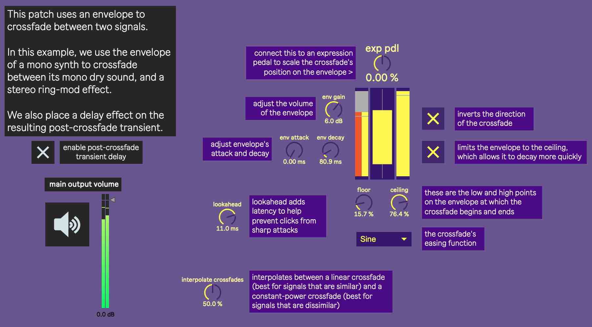

This transient crossfader is implemented in gen~. An envelope is generated from the third input, which crossfades between the first two inputs. The two crossfaded signals are output separately, which allows effects to be placed on either the transient or tonal sounds.

When adding effects pre or post-crossfade, remember to manually implement latency compensation to avoid comb filtering. 

The envelope input should connect to the sound source as directly as possible. Then any latency accrued with pre-crossfade effects can be considered lookahead.

I extracted this from my main rig, [which is available here.](https://github.com/jbaylies/sousastep)
